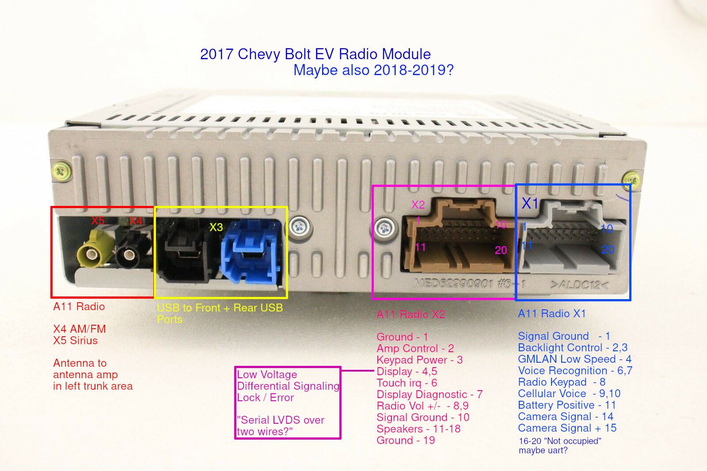
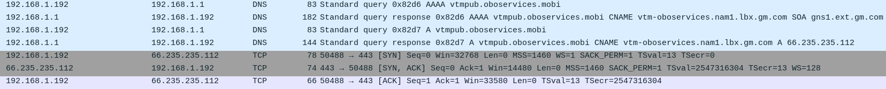
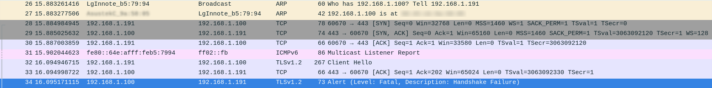

# Chevy Bolt EV Internals

This is a small collection of things i've discovered about the Chevy Bolt EV.

We haven't seen any OTA radio updates to the head unit, beatings will continue until
morale improves.

## OnStar

OnStar is a built-in 4G LTE-based data service which also lets you make phone calls to talk to OnStar representitives.

### OnStar Service Plans

Every Bolt EV comes with at least 5 years free of "EV Mobile Command". This lets you control the car, and see battery state of charge through the built-in 4G LTE modem.

### OnStar Instability

OnStar in 2017-2019 Bolt EV's has a habbit of going into periods of failing to serve requests for diagnostic information.

The end result is the battery SoC stops refreshing in the myChevrolet application, and API calls (for example via [onstar2mqtt](https://github.com/michaelwoods/onstar2mqtt) stop functioning until the vehicle is physically powered on again.

**Observations:**

* Unlocking and relocking the doors via remote - get_diagnostic request still failing
* Physically opening and closing doors - get_diagnostic request still failing
* Issuing vehicle commands through API (lock, unlock) - Functional, but get_diagnostic request still failing afterwards
* Plugging vehicle into a Level 2 charger - get_diagnostic request still failing
* Getting into vehicle, powering car on - get_diagnostic requests working again

After extensive trial-and-error, there doesn't seem to be a fixed set of conditions leading to this event. There also is no fix beyond physically powering the vehicle on via the start button.

### Disabling OnStar

OnStar can be disabled by powering the vehicle off (important per the repair manual, it has a battery) and pulling the OnStar fuse from the fuse panel under the drivers steering wheel.
Once disabled, [a blank filler plate](https://thingiverse.com/thing:5199130) can be 3d printed to replace the physical OnStar buttons.

Overall, the vehicle works as expected with the OnStar module disabled except for one problem. The in-vehicle microphone for bluetooth telephone calls will no longer function.
The microphone runs through the OnStar unit which seemingly amplifies or re-encodes the audio signal for the radio.

It might be possible to "bridge" the microphone directly to the radio unit via the following pins of OnStar X2 connector:

* 9 B24 Cellular Phone Microphone +
* 10 B24 Cellular Phone Microphone ground

* 6 Radio / Navigation Microphone +
* 12 Radio / Navigation Microphone -
* 5 Radio / Navigation Microphone ground

Connecting 9/10 to 6/12 might provide a functional in-vehicle bluetooth audio experience. Untested.

### Physical Access to OnStar module

The OnStar module (K73 Telematics Communication Interface Control) is physically located directly behind the central infotainment screen.
Access is not easy as you will need to remove the dash trim (containing the AC vents), then unscrew and remove the infotainment screen assembly.

## Dealer TechLink

* [How to fix the Bolts tires](https://techlink.mynetworkcontent.com/wp-content/uploads/2018/03/GM_TechLink_05_March_2018.pdf)
* [How to check if hilltop reserve is set](https://techlink.mynetworkcontent.com/wp-content/uploads/2018/12/GM_TechLink_22_Mid-November_2018.pdf)
* [How to install the Bolts seat cushions](https://techlink.mynetworkcontent.com/wp-content/uploads/2019/05/GM_TechLink_08_Mid-April_20191.pdf)
* [2020 bolts have a new battery chemistry, and are replacable in five sections](https://techlink.mynetworkcontent.com/wp-content/uploads/2019/11/GM_TechLink_20_Mid-October_2019.pdf)
* [How to tell if the wiring harness is seated all the way](https://techlink.mynetworkcontent.com/wp-content/uploads/2020/02/GM_TechLink_03_February_2020.pdf)

## Hidden functions

* Radio Reboot
  * Press and hold HOME + Fast Forward to reboot the infotainment.
  * This is a hardware feature and will solve any of the common radio "lockups"
* Service Mode
  * The shop manual documents a "Service Mode" for troubleshooting.
  * With the vehicle off, this is activated by holding the power button
    for 5 seconds with your foot *not* on any pedals.
  * The car will enter a "not ready" state, but systems will be online.
  * Press the power button again to exit.
  * No "hidden menus" have been found yet.

## Battery Recall

As of late 2020, NHTSA and GM began noticing an increasing trend of battery fires
unrelated to damage, accident, or abuse. Fires were seen in vehicles charging quietly
in owners garages overnight, or had finished charging recently. The issue begins with
smoke exiting the highest point in the battery pack (the service disconnect under the
rear seat). The entire car is eventually engulfed in flames damaging the surrounding
structure and vehicles.

A "final" software fix was released in April / May for impacted Bolt EV vehicles. (NHTSA 20V701)

After the final software fix, additional vehicles suffered the same fault prompting
another recall. (NHTSA 21V56)

On August 20th, 2021, the overall cause of fires reported by GM are two manufacturing
defects within the LG produced LiPo cells:

* A torn anode tab
* A folded separator

The combonation of these two defects is speculated to create an internal short within
the battery during normal cycling (expansion, contraction, etc) between the anode
and cathode resulting in a fire developing. Given the close proximity of cells, the fire
rapidly consumes the entire pack.

[allev.info list of known Bolt EV fires](https://allev.info/2021/07/list-of-known-chevy-bolt-fires/)

### History

* **November 13th, 2020 - NHTSA 20V701 (aka, the failed software fix)**
  * Battery may catch fire on 2017 - early 2019 Bolt EV's
  * Intrem software fix to limit battery SoC to 90% available immeadiately
  * Don't charge over 90% SoC until a "final" software fix is available
  * "Final" software fix was delivered for 2019 Vehicles on April 29th, 2021
  * "Final" software fix was delivered for all 2017-2019 Vehicles on May 26th, 2021
  * "Final" software fix includes improved monitoring, and attempts to set off the car alarm in the event of a thermal runaway.
* **July 23rd, 2021 - NHTSA 21V56**
  * Battery may catch on fire on 2017 - early 2019 Bolt EV's
  * Don't park inside a garage or other structure until solution available
  * Don't charge over 90% SoC or under 70 Miles of range until solution available
    * A trend is noticed of the issue happening on vehicles discharged < 30% and charged to full which aligns to GM's temporary recommendations
  * Owners can expect a replacement of all battery modules when available
    * GM announced the battery warranty "restarts" on recall replacement (8 year, 100,000 mile)
    * GM announced the capacity of the new cells would be 8% greater
* **August 20th, 2021 - NHTSA 21V65**
  * Battery may catch on fire on all 2019-2022 Bolt EV's and EUV's
  * Don't park inside a garage or other structure until solution available
  * Don't charge over 90% SoC or under 70 Miles of range until solution available
  * Owners can expect a replacement of some battery modules when available
* **November, 2021**
  * GM begins rolling out replacement batteries to priority vehicles.
    * Early 2019 Bolt EV's get the highest priority
* **December, 2021**
  * GM begins rolling out replacement batteries as they become available
  * A software workaround is made available to reduce SoC to 80% on vehicles unable to immediately get a battery replacement.

## Radio

* Radio Receiver S-band HD
  * GM Part Name: "Radio Control Unit"
  * Model Years
    * 2020 - 42728517 aka 42724911 / 42743929
    * 2019 - 42680220 aka 42676913 / 42746460
    * 2018 - 42670713 aka 42525185 / 42621253 / 42649077
    * 2017 - 42671556 aka 42571029 / 42583079
  * Made by LG Innotek for GM
  * Model LC10S , LC10-S , LC10SB , LC10-SB
  * FCC "Silver box radio" https://fccid.io/BEJLC10SB
  * Supports Bluetooth, 2.4Ghz WIFI and 5 Ghz Wifi.
  * Wireless Android auto requires 5 Ghz wifi, so the head unit can "technically" be upgraded to it in the future.
  * Seems to be QNX based
  * Firmware updates are signed and look like the following:
    * indication.16008211.0 -- Checksum?
    * update/42490971.bin -- Unknown
    * update/42615022_CPU.bin -- Unknown.. Likely encrypted QNX IFS filesystem
    * update/42615022.mnf -- Unknown.. Likely some manifest of what's in update package
    * update/42615022_OP.bin -- Unknown.. Likely more encrypted QNX updates
    * update/42615022.smd -- PEM Encryption keys, public. Checksums, sha256WithRSAEncryption
  * QNX IFS filesystems can be extracted, but since these are encrypted, the encryption would need to be broken first.
    * Private keys must exist on the head unit, and need extracted
    * Tools like https://github.com/askac/dumpifs exist
* Chevy Bolt EV OEM Radio Navigation 10" screen
  * GM Part Name: "GPS Navigation System"
  * Model Years
    * 2020 - 42620584
    * 2019 - 42662676
    * 2017,2018 - 42556932
  * Seemingly just a "Serial LVDS" touch screen and display?
* FM antenna is integrated into the rear window, with a connection via a three-pin female connector (only one pin is used) running to the FM amplifier near the middle of the top of the hatch just above the glass (visible once the plastic inner shroud is removed).  Technicians replacing the rear glass may forget to make the antenna connection, resulting in very poor FM reception.

### Upgradability

> Purely theoretical. Using the wrong parts may cause damage!

* Since the 2017 + 2018 model years used the same display, the radio receiver should be electrically "swappable" between them.
  * Obviously the ECU might have something to say about a non-matching radio control unit.
* 2019, 2020 both have a differing part number for the display.
  * It could be minor mechanical differences however?
* The Bolt EV service manual is the same? per GM for 2017-2019 so the pinouts may be identical?

### Radio Firmware Updates

* Radio performs a DNS lookup of vtmpub.oboservices.mobi
  * CNAME *USED* to be vtm-oboservices.nam1.lbx.gm.com (66.235.235.112, "Quality Technology Services")
  * CNAME *NOW* rcms-na-oboservices.nam1.lbx.gm.com (198.208.178.32, GM Subnet)
* TLS ECDSA certificate required.  No matching ciphers for RSA certificates.
  * TLS_ECDHE_ECDSA_WITH_AES_128_GCM_SHA256 (secp256r1) - A
  * TLS_ECDHE_ECDSA_WITH_AES_128_CBC_SHA (secp256r1) - A
  * TLS_ECDHE_ECDSA_WITH_AES_128_CBC_SHA256 (secp256r1) - A
  * TLS_ECDHE_ECDSA_WITH_AES_256_GCM_SHA384 (secp256r1) - A
  * TLS_ECDHE_ECDSA_WITH_AES_256_CBC_SHA (secp256r1) - A
  * TLS_ECDHE_ECDSA_WITH_AES_256_CBC_SHA384 (secp256r1) - A
  * TLS_ECDHE_ECDSA_WITH_3DES_EDE_CBC_SHA (secp256r1) - C
* Vehicle checks the remote server aginst a trusted pool of GM CA's
  * tlsv1 alert unknown ca:SSL alert number 48) while SSL handshaking
* Radio requests information from server (likely VIN tied)
* TLS guards from seeing any information about this request :-(

### Man in the middle

* Radio does not seem susceptible to man-in-the-middle attacks. TLS certificates are fully
  validated on the radio, and the request fails.

## Chevy Calibrations (aka, firmware updates)

Chevy releases new calibrations (software patches) for their cars, classically these have been to adjust things like engine timing. However, in an EV these updates adjust things like DCFC charging curves.
**20-NA-053** is a service bulletin for all 2017-2019 Chevy Bolt's released by GM to improve DCFC in cold weather.

To get this update, you have to head to the dealership, ask your service technician *NICELY* and trust that they'll actually apply it.
...or, you can apply it (and any future updates) yourself.

> I'm pretty sure GM offers acdelcotds.com to the public because of right-to-repair laws. They're just betting you don't know how to use it. Now you do!

### Terms

* SAE-J2534 - All new vehicles need to support these standards to reprogram systems which can include emmissions control changes
* Tech2 - An older diagnostic system for GM vehicles. You don't need to mess with this
* GDS2 - GM's current diagnostic system, which supports firmware updates via SAE-J2534
* TIS2WEB - A web-based java diagnostic and repair system. Replaced by Techline Connect
* Techline Connect - A java desktop diagnostic and repair system
* Operating System - Base operating system of device
* Calibrations - Applied on top of base operating system (like updates, patches)

### Tools Needed

* Windows 10 laptop of reasonable specifications
* Internet connection
* [GDS2 Adapter](http://www.vxdiagshop.com/wholesale/vxdiag-vcx-nano-for-gm-opel-wifi-version.html) -- $105
  * This is the one I use, it works fine and is a cheap Chinese clone.
  * **DOES NOT WORK WELL WITH THE NEW TECHLINE CONNECT!**
* An account on https://www.acdelcotds.com/ and $40 per VIN gives you two years of firmware updates
  * You can search for updates for your vehicle before purchase by using [tis2web](https://tis2web.service.gm.com/tis2web)
  * This is the same tool Chevy dealers use. You can reprogram / re-vin an ECU, etc.

### Process

> WARNING: Dragons ahead. These steps can "brick" your entire car if performed improperly.

* Follow the instructions on your GDS2 adapter to set it up.
* Navigate to https://www.acdelcotds.com/ and follow the steps for "Vehicle Programming Software" / tis2web
* While choosing subsystems to program, here are some key points:
  * DON'T REPROGRAM SAFETY SYSTEMS! Anything body control, airbag, etc. Some of these require special steps.
  * Function: Generally "Programming"
  * Programming Type: "Normal"  ("VCI" is some special GM software drop for individual vehicles)
  * RPO Codes - Select the RPO code based on what is in your glovebox.
    * RPO IOB == Select this if your glovebox sticker lists "IOB"
    * RPO -IOB == Select this if your globebox sticker *doesn't* list "IOB"
* Follow the instructions *carefully* and perform all steps tds2web instructs you to.
* Don't interrupt programming!
